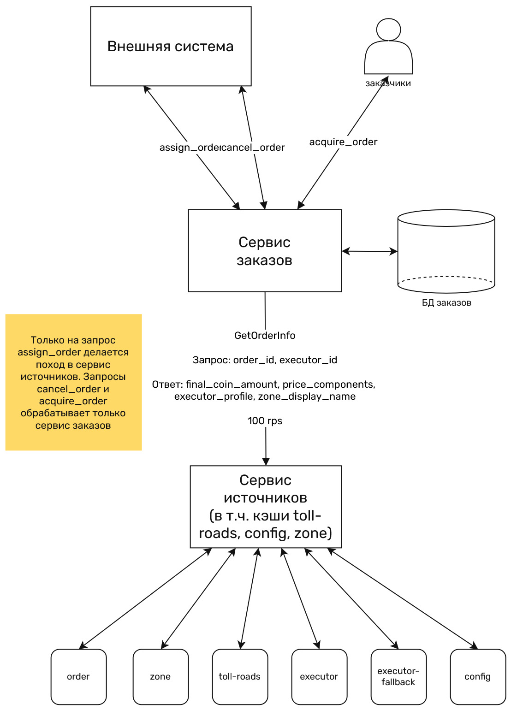

# ADR

Архревьюер: Павел Назаров.

## Какую задачу мы решаем?

Разрабатываем сервис хранения и обработки информации о заказах.

## Доменная область

Начальная архитектуры, то есть все области проекта.

## Пользовательские сценарии

У нашего сервиса должно быть два вида пользователей: заказчики и исполнители. Заказчики создают и отменяют заказы, а исполнители получают информацию о назначенных им заказах.

Запросы от заказчиков должны приходить в наш сервис проходя через сторонний сервис, который назначает заказы исполнителям. Поэтому наш сервис не должен заниматься назначением заказов исполнителям.

## Функциональные требования

### Роли пользователей

- Заказчик
- Исполнитель заказов

### Сценарии использования

- Заказчики будут создавать заказы, внешний с нашей точки зрения сервис будет назначать их исполнителям и присылать нам запрос о заказе от такого-то пользователя с таким-то исполнителем. Если приходит запрос на назначение заказа исполнителю, который уже исполняет какой-то заказ, то ему должен назначаться новый, а старый должен получать статус завершенного. Таким образом на каждый заказ должен назначаться ровно один исполнитель, и на каждого исполнителя одновременно должно быть назначено не больше одного заказа.
- Исполнители постоянно находятся на линии и опрашивают нас раз в минуту, чтобы узнать, какой заказ им в данный момент назначен.
- Также заказчики могут отменять заказы. В этом случае заказ получает статус отмененного, больше с этим заказом ничего не происходит, его исполнитель становится свободным.

### Требования по платформам (desktop, mobile и т.д.)

Не нужно различать трафик desktop/mobile.

## Нефункциональные требования

### Взаимодействие с источниками

Сервис должен получать данные из следующих источников:

1. начальная конфигурация сервера (`config`)
2. данные о заказе (`order`)
3. повышающий коэффициент зоны заказа (`zone`)
4. данные о платных дорогах в зоне заказа (`toll-roads`)
5. данные об исполнителе (`executor`)
6. фоллбэк-источник данных об исполнителе (`executor-fallback`)

Цена заказа должна формироваться из источников 2-4.

### Latency

Latency не должно расти при длительной нагрузке с rps не более, чем заданным.

### Масштабируемость

Требуемые значения rps по каждому из видов запросов (могут быть одновременно):

- 100 rps на создание заказов (ручка POST /orders/assign)
- 5 rps на отмену заказов (5% от создания заказов) (ручка POST /orders/cancel)
- 8334 rps на узнавание исполнителями статусов (500'000 исполнителей, каждый из которых проверяет свой статус раз в 60 секунд) (ручка GET /orders/acquire)
- Один заказ занимает 1Кб в БД

Система должна линейно масштабироваться к нагрузке.

### Отказоустойчивость

Источник `order` является *критичным*. Это значит, что его ответы нужны всегда в самом свежем виде, нельзя применять кэширование или использовать фоллбеки (дефолтное значение).

Остальные четыре источника *некритичные*. Это значит, что при их отказе их ответы можно заменять. А именно:

1. `config`: кэш, обновляемый каждую минуту.
2. `zone`: LRU-кэш. Данные старше 10 минут не должны использоваться, то есть в этом случае нужно считать, что данных нет.
3. `toll-roads`: кэш + фоллбэк, если в кэше ничего нет.
4. `executor`: поход на fallback-источник данных (`executor-fallback`).

### Требования по срокам хранения данных

Бесконечно. Считаем, что 20 лет.

## Решение

### API

1. `PUT` `/orders/assign?order_id=...&executor_id=...&zone_id=...`
   - `400`, json `{"message": "Missing parameters, please provide order_id, executor_id and zone_id"}`, если хотя бы один из параметров `order_id`, `executor_id` или `zone_id` отсутствует в запросе.
   - `400`, json `{"message": "AssignedOrder with provided orderId already exists"}`, если происходит попытка зарегистрировать назначенный заказ с `order_id`, уже известным сервису. Заметим, что если подобное обращение происходит вследствие дублирования одного и того же запроса, то результат эквивалентен единичному применению запроса, поэтому данная операция идемпотентна.
   - `200`, json `{"message": "Successfully created"}` в случае успешной регистрации назначенного заказа.
   - `500`, json `{"message": "Unknown error"}` в случае любой внутренней ошибки сервиса. В интересах безопасности содержание ошибки не раскрывается пользователям данной ручки.
2. `GET` `/order/acquire?executor_id=...`
   - `400`, json `{"message": "Missing parameters, please provide executor_id"}`, если в запросе отсутствует `executor_id`.
   - `200`, json `{"message": "Successfully acquired", "order_profile": {...}}` в случае успешного получения назначенного заказа. В `order_profile` будет лежать заказ в схеме, идентичной схеме в БД (см. ниже).
   - `200`, json `{"message": "There are no orders assigned to you"}` в случае, если каждый заказ, когда либо назначенный на исполнителя, был выполнен или отменён.
   - `500`, json `{"message": "Unknown error"}` в случае любой внутренней ошибки сервиса. В интересах безопасности содержание ошибки не раскрывается пользователям данной ручки.
3. `POST` `/order/cancel?order_id=...`
   - `400`, json `{"message": "Missing parameters, please provide order_id"}`, если в запросе отсутствует `order_id`.
   - `200`, json `{"message": "Successfully canceled"` в случае успешной отмены заказа.
   - `200`, json `{"message": "AssignedOrder with OrderId $$order_id does not exist or has already been canceled"}` в случае, если данный заказ уже отменён, или выполнен, или никогда не существовал.
   - `500`, json `{"message": "Unknown error"}` в случае любой внутренней ошибки сервиса. В интересах безопасности содержание ошибки не раскрывается пользователям данной ручки.

### Архитектура

Основная БД -- БД заказов. Её схема:

```text
string assign_order_id // отдаем “наружу” исполнителю
string order_id // приходит “снаружи” в нашу систему
string executor_id
enum status // {assigned, acquired, cancelled, completed}
float base_coin_amount
float coin_coeff
float coin_bonus_amount
float final_coin_amount
string route_information
bool used_executor_fallback // использовался ли fallback источника executor вместо обычного.
time assign_time // время сразу же перед первой записью заказа в БД
time acquire_time // время первой отдачи этого заказа исполнителю
```

Сервис должен состоять из двух микросервисов:

- Микросервис заказов. Занимается всем взаимодействием с БД заказов и с вторым микросервисом. Не делает рассчет стоимости заказа и походы в источники.
- Микросервис источников делает всю логику походов в источники. То есть сами походы и принятие решений о замене ответа кэшом или фоллбэком. В БД заказов он не ходит. Для кэширования ответов тех источников, для которых это нужно (toll-roads, config и zone), должна использоваться встроенная в ЯП библиотека для LRU-кэшей.



### Взаимодействие микросервисов

Для взаимодействия двух микросервисов между собой нужно использовать gRPC. Это поможет снизить размер сообщений, накладные расходы на их парсинг и упростит реализацию (поскольку из протобуфов генерируется код).

### Рассчет требуемой нагрузки

Данные требуется хранить 20 лет. На один заказ требуется 1Кб хранилища. В секунду будет создаваться 100 заказов. При отмене заказы не должны удаляться из базы. Итого за 20 лет работы сервиса накопится $20*365.25*24*60*60 = 631152000$ заказов. Для их хранения потребуется $~602$ Гб. У БД 2 реплики, поэтому в итоге получится $~1204$ Гб.

На микросервис заказов идут только запросы создания заказа, то есть 100 rps. Это немного, его шардировать не придется.

Возможно, для выдерживания требуемой нагрузки в 8334 rps на GET /orders/acquire потребуется шардирование микросервиса заказов, сделать N шардов. Микросервис не хранит состояние, поэтому для шардирования достаточно поставить несколько одинаковых инстансов и синхронизировать их между собой никак не нужно. В таком случае потребуется добавить L7-балансировщик, который будет отправлять запрос в случайный шард. По каждой из ручек rps уменьшится N раз.
